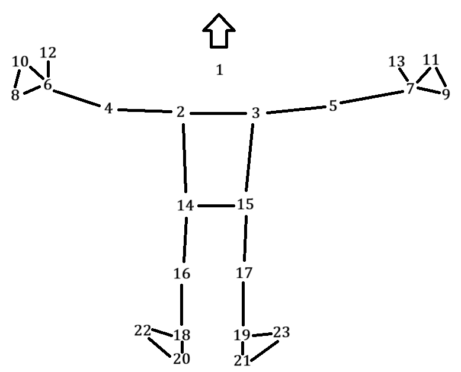

# Key Frame Detection in Badminton Swings and Its Application to Physical Education
[-p.91248--91262-gray?labelColor=%2300629B)](https://doi.org/10.1109/ACCESS.2025.3572105)

## Abstract
The use of video analysis in sports training has revolutionized the way coaches and players evaluate performance and develop strategies. This paper presents a machine learning based approach for key frame detection in badminton swings aimed at improving the learning experience for beginners through visualization and real-time feedback. Our proposed method uses the MediaPipe framework to extract 3D coordinates of skeleton joints, which serve as input features for a machine learning based model that accurately predicts key frame positions in badminton swing videos. This model is integrated into a mobile app developed for Android tablets, allowing learners to record their swings and compare them with those of professional players, thereby enhancing badminton learning. Comparative studies show that models with graph convolutional networks, a prominent approach commonly used in skeleton-based human action recognition, outperform other existing methods in terms of accuracy and reliability. Experimental studies demonstrate the app’s positive impact on performance, motivation, and self-perception. One main contribution of this research is the development of a robust key frame detection model. Another main contribution is that we implement this key frame detection model in a tablet and verify it through extensive experiments.

**Keywords:** Badminton, key frame detection, sports education, computer vision, graph convolution network, multi-layer perceptron

## Dataset
Data is converted from the raw video files of badminton swings to 23 skeletal joint coordinates by using [MediaPipe](https://ai.google.dev/edge/mediapipe/solutions/guide?hl=zh-tw) tools.



- `all_coordinates_xy.csv`: all 2D joints.
- `all_coordinates_list.csv`: all 3D joints.
- `label_all_keyframe.csv`: all labels with class ID 0, 1, 2 or 3.
- `label_all_keyframe_add.csv`: similar to `label_all_keyframe.csv` but with more instances of class ID 1.
- `videos_length.npy`: the number of frames in each video.
- `data_trial` folder: for additional testing (test set 1 in the paper).

## Code
### Partial Code with TensorFlow
(In `my_senior's_code` folder)
- `joint_detection.ipynb`: an example for converting the raw images to human joints.
- `NN_BorderlineSMOTE.ipynb`: for MLP, 1D-CNN in the paper.
- `RNN_BorderlineSMOTE.ipynb`: for LSTM, GRU in the paper.

### Partial Code with PyTorch
[](https://www.python.org/downloads/) [](https://pytorch.org/)

(In `my_code` folder)
- `dataset.py`: for loading the dataset.
- `<model_name>.py`: for modified ST-GCN, SkateFormer, BlockGCN architectures in the paper.
- `<model_name>_main<X>.py`: for training and testing the models.
    - `<X=None>`: padding loss is used.
    - `<X=2>`: padding loss is masked.
    - `<X=3>`: `<X=None>` with adding `k`th partition train-test iteration in `k`-fold cross-validation.
    - `<X=4>`: `<X=2>` with adding `k`th partition train-test iteration in `k`-fold cross-validation.
    - `<X=4_loop>`: run all `<X=4>` iterations for `k`-fold cross-validation.

## Citation
If you use our dataset to publish a paper, we would appreciate it if you cite our paper.
```
@ARTICLE{11008633,
  author={Hsu, Jen-Hao and Lee, Chi-Chuan and Chang, Jing-Yuan and Lee, Duan-Shin},
  journal={IEEE Access}, 
  title={Key Frame Detection in Badminton Swings and Its Application to Physical Education}, 
  year={2025},
  volume={13},
  number={},
  pages={91248-91262},
  keywords={Sports;Videos;Training;Skeleton;Graphical user interfaces;Machine learning;Visualization;Human activity recognition;Games;Accuracy;Badminton;key frame detection;sports education technology;computer vision;graph convolution network;multi-layer perceptron},
  doi={10.1109/ACCESS.2025.3572105}}
```
